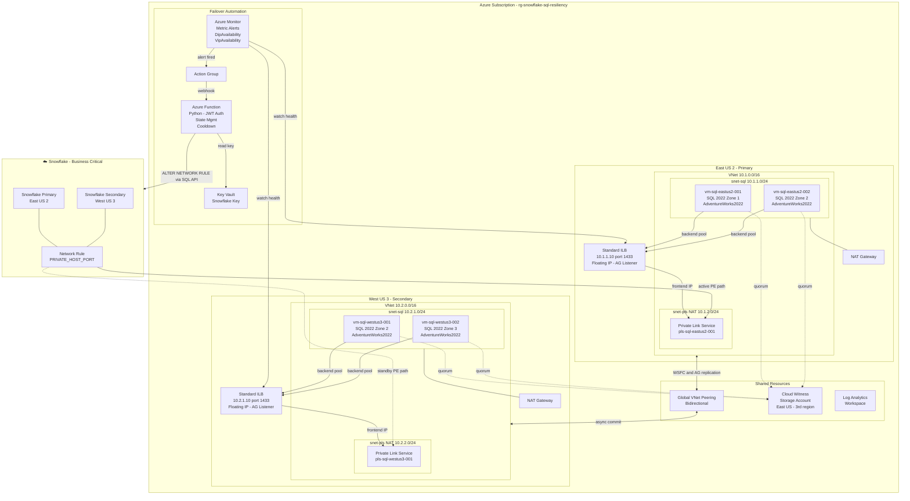
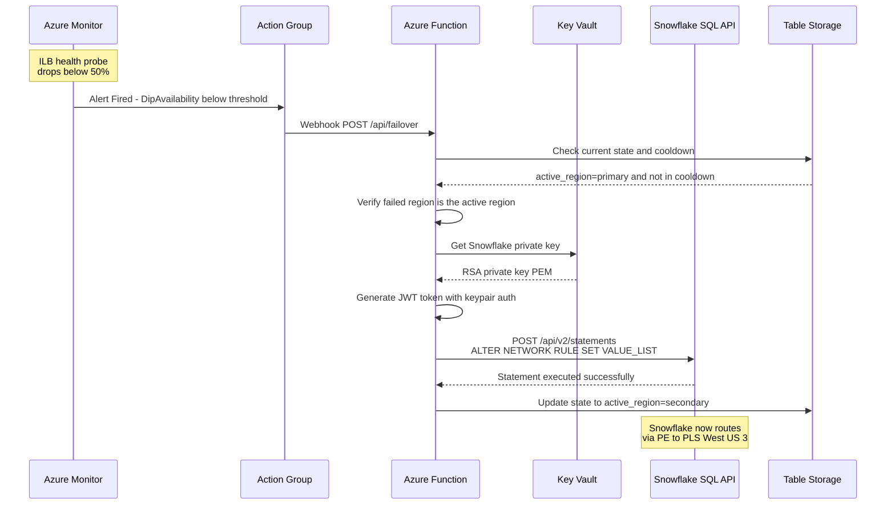
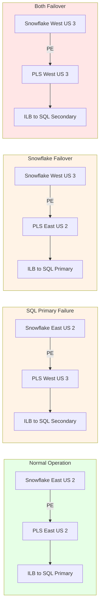

# Architecture Diagram

## Full Architecture

## Automated Failover Sequence

## Failover Scenarios

## Component Summary

| Component | Resource | Purpose |
|-----------|----------|---------|
| **SQL VMs** | 4x Standard_E4ds_v5/v4 | SQL Server 2022 Enterprise with AdventureWorks2022 |
| **ILB** | 2x Standard Internal LB | AG listener on port 1433, floating IP, health probe 59999 |
| **PLS** | 2x Private Link Service | Expose ILB to Snowflake via Private Endpoints |
| **VNet Peering** | Bidirectional global | WSFC/AG replication traffic between regions |
| **Cloud Witness** | Storage Account (East US) | WSFC quorum in third region |
| **NAT Gateway** | 2x per region | Outbound internet for SQL VMs |
| **Azure Function** | Python, Consumption plan | Automated failover via Snowflake SQL API |
| **Monitor Alerts** | 4x metric alerts | DipAvailability + VipAvailability per ILB |
| **Key Vault** | Standard | Stores Snowflake RSA private key for JWT auth |
| **Log Analytics** | PerGB2018 | Centralized monitoring |
