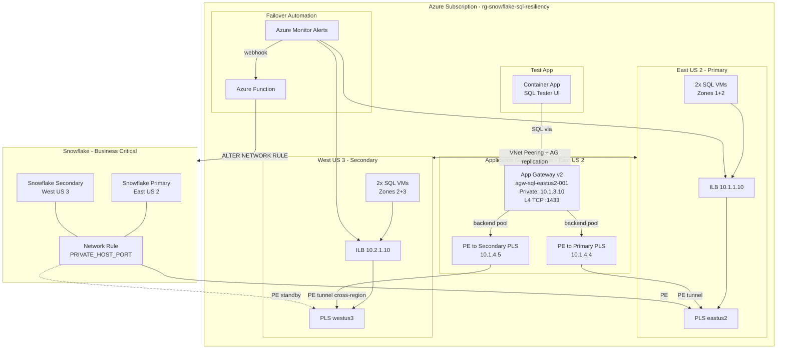

# Architecture Diagram

## Full Architecture



## Data Flow

```
Test App / Snowflake
    |
    v
App Gateway (10.1.3.10:1433)   <-- L4 TCP proxy, health-checks both backends
    |
    +---> PE (10.1.4.4) ---> PLS East US 2 ---> ILB (10.1.1.10) ---> SQL VMs (Primary)
    |
    +---> PE (10.1.4.5) ---> PLS West US 3 ---> ILB (10.2.1.10) ---> SQL VMs (Secondary)
```

## Component Summary

| Component | Resource | Purpose |
|-----------|----------|---------|
| **App Gateway v2** | agw-sql-eastus2-001 | L4 TCP proxy with health-based routing to both SQL regions |
| **PE Primary** | pe-pls-primary-sql (10.1.4.4) | Private tunnel to East US 2 PLS |
| **PE Secondary** | pe-pls-secondary-sql (10.1.4.5) | Private tunnel to West US 3 PLS (cross-region) |
| **SQL VMs** | 4x Standard_E4ds | SQL Server 2022 with AdventureWorks2022 |
| **ILB** | 2x Standard Internal LB | AG listener port 1433, floating IP |
| **PLS** | 2x Private Link Service | Expose ILBs to PEs |
| **Test App** | Container App | Web UI for SQL connectivity testing |
| **Failover Function** | Azure Function | Automated Snowflake network rule failover |
